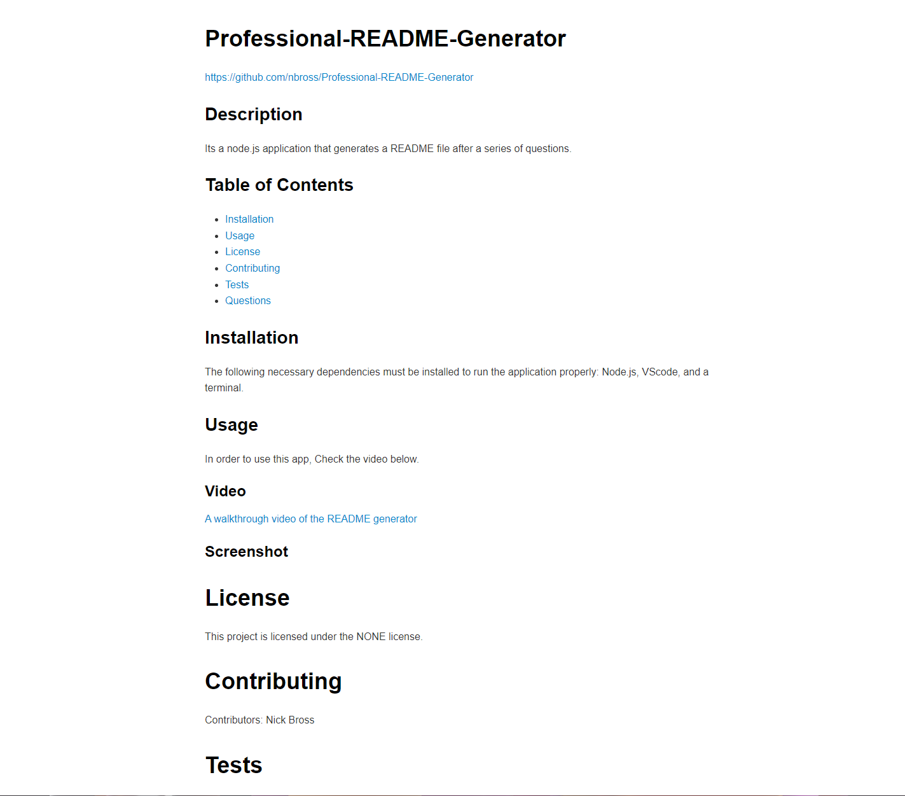

  # Professional-README-Generator
  https://github.com/nbross/Professional-README-Generator
  ## Description
  Its a node.js application that generates a README file after a series of questions.
  ## Table of Contents 
  * [Installation](#installation)
  * [Usage](#usage)
  * [License](#license)
  * [Contributing](#contributing)
  * [Tests](#tests)
  * [Questions](#questions)
  ## Installation
  The following necessary dependencies must be installed to run the application properly: Node.js, VScode, and a terminal.
  ## Usage
  In order to use this app, Check the video Below.
  ### Video
  [A walkthrough video of the README generator](https://youtu.be/b5TtGhV09G8)
  ### Screenshot
  
  # License
  This project is licensed under the NONE license. 
  # Contributing
  ​Contributors: Nick Bross
  # Tests
  The following command is needed to run the test: node index.js
  # Questions
  If you have any questions about the repo, open an issue or contact nbross directly at : nbross2001@gmail.com.
